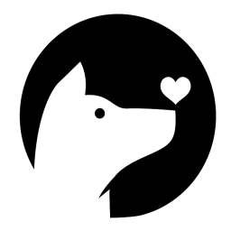

# Lucy Help
Lucy is an Entity Recognition engine which defines a simple yaml syntax for recognizing **entities**.

# Entities
Entites are *named fragments of information*. 

When entities are recognized they have **resolution** which is structural
information from the recognition process.

For example, ```@dimension``` outputs a structure ```{ value:13, units:inches }```

Entities are made up of 1..N token patterns.

# Patterns
A pattern is a definition of the sequence tokens and/or entities which make up your entity. 

Lucy uses Lucene language text tokenizers (analyzers) to normalize text into tokens
with using stemming, punctation, case normalization, etc. This allows you to work
purely at the token level freeing you from worrying about about punctionation, stemming, etc.

A simple pattern such as ```walking the dog``` is defining that Lucy should look for 
a sequence of normalized tokens ```["walk", "the", "dog"]```.

> NOTE: Patterns are evaluated at the **token** level after normalization using
> Lucene text analzyers.
 
Alternatively, a pattern can be defined as a traditional character stream based regular expression.
To signal that the pattern is a regular expression the pattern should start and ends with '/' char.

```yaml
  # match tail numbers like N185LM 
  - name: '@tailNumber'
    patterns: 
    - /N[\dA-Z]{5}/
```
> NOTE: The regex character pattern matching is only recommended to be used for
> matching character entities that are structured and impossible to recognize at
> the token level. (such as part numbers, SSN numbers, etc.). 

## Token patterns
Matching a set of alternative tokens is the simplest case. To do this is easy:
```yaml
  - name: '@drinkSize'
    patterns: 
    - small
    - medium
    - large
```

Given text like ```I would like a large``` will match ``@drinkSize = large``.

## Synonyms and canonical values
You can control the canonical value that is passed to your program by using an array.

In the following example, instead of just ```small, medium, large, extra large``` 
we are defining synonyms on each line, normalizing the resolution to the letters ```s, m, l, xl```.

```yaml
  - name: '@drinkSize'
    patterns:
    - [s, small, short, tiny]
    - [m, medium, tall]
    - [l, large, big]
    - [xl, extra large, venti, huge, ginormous, enormous]
```
Given text like ```I would like a extra large``` will match ``@drinkSize = xl``.

## Entity references
In a pattern sequence you can refer to an entity by using ```@``` prefix in
front of the entity name.

 ```@xxx``` in a sequence means
*"if you found an entity called ```xxx``` aligning here in the token sequence, then I would
match that please."*

Example:
```yaml
  - name: '@animal'
    patterns:
    - dog
    - cat
    - snake

  - name: '@myentity'
    patterns:
    - walk the @animal
    - feed the @animal
    - pet the @animal
```
This defines an entity ```@animal``` which will recognize the animal tokens.  ```@myentity``` will 
match ```walk the dog```, because it sees that ```@animal`` aligns.  Because it matched on an 
entity it will capture the entity value for animal.

## Alternates
Just like regular expressions you can define alternitives inline by putting parens 
around a set of tokens seperated by the pipe character '|'.   ```(token|token|token)```

```yaml
  - name: '@animal'
    patterns:
    - (dog|cat|snake)
```

This enables a you to express multiple permutations of patterns by composing your alternation patterns together like this:
```yaml
  - name: '@animalOperation'
    patterns:
    - (walk|pet|feed) the (dog|cat|snake)
```

## Quantifiers
Just like in regular expressions you can define ordinality on groups.

| postfix | description                       |
|---------|-----------------------------------|
| ?       | match zero or one                 |
| *       | match zero or more                |
| +       | match one or more                 |
| *#      | match zero or more (max # tokens) |
| +#      | match one or more (max # tokens)  |

```yaml
  - name: '@example'
    patterns:
    - (walk|feed|pet) (the)? (dog|cat|snake)+2
```

## Fuzzy Matching
Matching on tokens when your text is spelled correctly is great, but in reality the input
data is not clean.  People spell poorly, speech rec provides a word which sounds
right, but is wrong word, etc. **Fuzzy matching** enables phonetic matching
when comparing tokens, making the pattern recognition much more robust.

There are 2 ways to enable fuzzy matching. 
1. You can use the ```~``` postfix character to enable fuzzy matching on a alternate group.
2. you can use the ```fuzzyMatch``` property on an entity definition to apply fuzzy
matching to all patterns in the entity definition.

```yaml
  - name: '@example1'
    patterns:
    # fuzzy match only on tokens des moines 
    - (des moines)~
    - seattle
    - ...

  - name: '@example2'
    # fuzzy match turned on for all patterns in this entity definition.
    fuzzyMatch: true
    patterns:
    - mummy
    - dracula
    - sasquatch
    - ...
```

## Wildcards
Wildcards enable you to capture entities which can only be expressed by their postion 
in a sequence relative to other tokens.  These are esssentially empty slots, and are
expressed with three underscore characters ```___```.

This represents a single token which is captured because of the token sequence around 
it. 

```yaml
  - name: '@name'
    patterns:
    - name is ___
    - call me ___
    - ___ is my name
```
So with an input, ```my name is ishmail``` the result will be ```@name = 'ishmail'```. 

Wildcards can be placed in alternate groups with quantifiers```(___)*``` , allowing 
you to capture a sequence of unknown tokens into an entity. 

Repeating wildcards will take tokens until they run into a token which is claimed
by any pattern in the system. 

## Named wildcards
You can assign entity names inline when defining a wildcard by using the pattern
```(entityname:___)```. 

```yaml
  - name: '@name'
    patterns:
    - name is (firstname:___) (lastname:___)?
```

# Lucy file format

A Lucy file (**xxx.lucy.yaml**) has 4 top level properties:

| name                                  | description                 |
|---------------------------------------|-----------------------------|
| [locale](#locale)                     | the locale for tokenization |
| [entities](#entities)                 | entity definitions          |
| [macros](#macros)                     | macro definitions           |
| [externalEntities](#externalEntities) | external entity definitions |

## **locale** property
The **locale** property defines the language tokenizer to use. 
> The **locale** property is optional.
>
> The default value is 'en'

Example:
```yaml
locale: en
```

## **entities** property
An **entity** definition defines a named set of patterns.

### Entity Defintion 
The **entities** property is made up of 1 or more entity definitions.

An **entity** definition is a object with 3 properties:

| name       | description                                                               |
|------------|---------------------------------------------------------------------------|
| name       | the name of the entity                                                    |
| fuzzyMatch | sets the default fuzzyMatch for all tokens in the patterns of this entity |
| ignore     | tokens to ignore when evaluating this entity                              |
| examples   | example phrases, not used by Lucy but could be used by ML systems         |
| patterns   | is array of pattern strings (see [Patterns](#Patterns) )                  |

> the name does not have to start with '@', but by convention it makes the file easier to read.

Example:
```yaml
entities:
  - name: '@colors'
    patterns: [red, green, blue, yellow, orange, indigo, violet]
    
  - name: '@drinkSizes'
    patterns:
    - small
    - medium
    - large
    - extra large
```
## **macros** property
The **macros** property lets you define a named fragment of text that will be substituted 
into any pattern.
> The **macros** property is optional.
>
> Macro names must start with '$'

```yaml
macros:
  $foo: (x|y|z)
entities:
  - name: '@test'
    patterns:
    - I want $foo to match.
```

## **externalEntities** property
You can reference external entities (*entities which are detected externally and passed in*)
as part of a pattern just like any other entity.

Adding an external entity reference to this property will suppress warnings that you are referencing
an entity which is not defined in the .yaml file.

```yaml
externalEntities: ['@foo','@bar']
```
